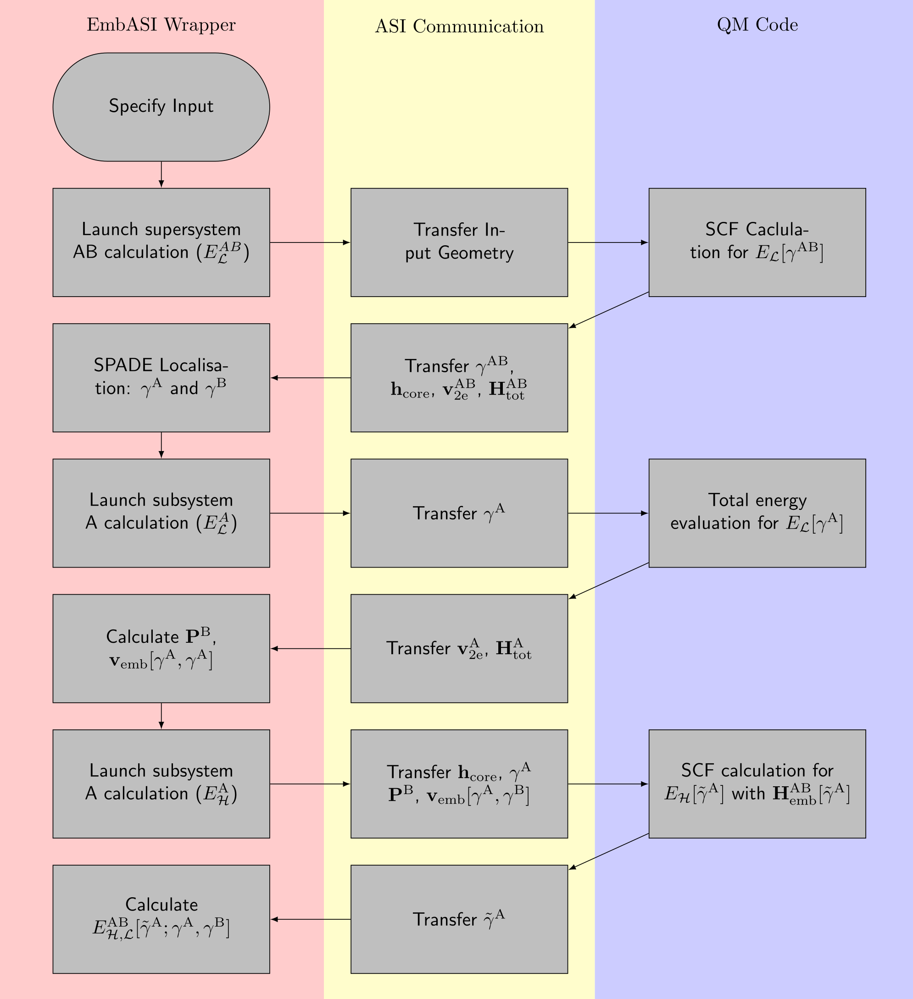

======================================
Developer Guide to Implementing EmbASI
======================================

Introduction
~~~~~~~~~~~~

EmbASI is designed as a minimal workflow for abstracting the tasks associated
with embedding to a Pythonic wrapper. The modification to the host codebase
should be small, but some routines for exporting and importing the correct
data structures will need to be integrated into your core SCF loop. The placement
of these routines should be fairly general, but familiarity with your codebase
is desirable to implement the required control flow mechanisms.

Where possible, we have provided template routines in ``<EmbASI_ROOT>/templates/fortran/qm_embedding.f90``
which wrap around the expected import and export routines for each
matrix quantity.

Before implementing EmbASI into your QM code, you will require the following
features in your codebase:
   1. An interface to the ASI API, see: :ref:`section-asi-api`.
   2. The ability to output the core Hamiltonian (or the one-electron Hamiltonian) and the two-electron Hamiltonian (electrostatic and exchange-correlation contributions).
   3. The ability to set certain atomic sites as ghost atoms.

.. _section-asi-api:
Atomic Simulation Interface (ASI) API
~~~~~~~~~~~~~~~~~~~~~~~~~~~~~~~~~~~~~

ASI is a C-based API which manages the transfer of data structures
to and from the QM driver. The vast majority of development work
required to implement EmbASI will involve implementing the C-based
callback infrastructure of ASI. `Template routines and an installation
guide are included in the ASI API documentation. <https://gitlab.com/pvst/asi/-/tree/main/src/dev_templates/fortran?ref_type=heads>`__
where certain matrix dimensions are stored in your codebase, the
callback routines should hopefully work out of the box with the
templates provided.

Implementing the EmbASI Workflow
~~~~~~~~~~~~~~~~~~~~~~~~~~~~~~~~

The following is a guidance for implementing the projection-based
embedding scheme of Manby et al. :cite:p:`manby2012` The workflow below shows the calling
pattern for each respective supersystem/subsystem as well as the
quantities expected for each total energy calculation. :cite:p:`bramley2025`

The projection-based embedding procedure calls the QM driver to:
   1. Perform a full SCF calculation for the whole supersystem (AB) at the low-level of theory (:math:`\mathcal{L}`).
   2. Perform a total energy evaluation for the embedded subsystem (A) at the low-level of theory with the localised density matrix (:math:`\gamma^{\mathrm{A}}`).
   3. Perform a SCF calculation for the embedded subsytem at the high level of theory (:math:`\mathcal{H}`) subject to the embedded Hamiltonian (:math:`\mathbf{H}^{\mathrm{AB}}_{\mathrm{emb}}[\tilde{\gamma}^{\mathrm{A}}]`).

Expected Matrix Exports
~~~~~~~~~~~~~~~~~~~~~~~

At each calculation stage, it is expected that upon completion, four
matrices are output to the EmbASI wrapper:
   1. The total overlap matrix (:math:`\mathbf{S}^{\mathrm{AB}}`)
   2. The one-electron Hamiltonian (:math:`\mathbf{h}_{\mathrm{core}}`).
   3. The two-electron potential (:math:`\mathbf{v}_{\mathrm{2e}}`).
   4. The total Hamiltonian (:math:`\mathbf{H}_{\mathrm{tot}}`).
   5. The density matrix for the appropriate subsystem (:math:`\mathbf{\gamma}^{\mathrm{AB}}, \mathbf{\gamma}^{\mathrm{A}}, \tilde{\mathbf{\gamma}}^{\mathrm{A}}`,
      where :math:`\tilde{\gamma}` represents the converged density matrix evaluated at the high-level of theory).

To integrate these routines within your workflow, the following routines
from the ``qm_embedding`` template should be added in the following parts of your code:
   1. ``export_overlap``: after the construction of the overlap matrix.
   2. ``export_allH``: after the final iteration of the SCF cycle.
   3. ``export_densmat``: after the final iteration of the SCF cycle.

Expected Matrix Imports
~~~~~~~~~~~~~~~~~~~~~~~

Two import callbacks should be integrated into the SCF cycle:
  1. ``import_EmbASI_densmat``: Imports the externally constructed density matrix. This routine
     should be called the construction of the terms required for the Hamiltonian.
  2. ``set_embedding_H``: Imports the embedding potential and the projection matrix and adds them
     to your Hamiltonian. This statement should be added before the entry of the Hamiltonian into
     the eigensolver routine.

Keyword Modification
~~~~~~~~~~~~~~~~~~~~

At the wrapper level, callbacks should only be registered when they are
required. However, implementing the following keywords
should be done to enable extra control flow mechanisms and error checking.

At present, the keyword ``qm_embedding_calc`` is used as an input to
modify the control flow of the calculation. The expected arguments for
this keyword are:
   1. ``qm_embedding_calc = 1``: Full SCF with no modification.
   2. ``qm_embedding_calc = 2``: Total energy calculation that skips the SCF cycle. The total energy evaluation for the low-level reference of the embedded subsystem (:math:`E_{\mathcal{L}}[\gamma^{\mathrm{A}}]`) requires only the total energy corresponding to :math:`\gamma^{\mathrm{A}}`. In effect, this corresponds to running the SCF cycle for a single iteration and calculating the total energies as the expectation value of the input Hamiltonian.
   3. ``qm_embedding_calc = 3``: Full SCF with the embedded Hamiltonian. This keyword indicates that ``set_embedding_H`` should be invoked for the given QM driver call.

Python Interface Modifications
~~~~~~~~~~~~~~~~~~~~~~~~~~~~~~

Input file generation and output file parsing is performed with `ASE <https://ase-lib.org/>__. The syntax for some input parameters, including the total charge and specification of ghost sites, differ between each calculator, and the mechanism used to export matrix quantities (density matrices, Hamiltonians, overlap) once a calculation has run also differs between codes (e.g., callbacks registered ahead of an ASI-driven run versus attributes read directly off the calculator afterwards). EmbASI requires the correct specification of both of these in the ``qmcode_adapters`` module. This module contains the abstract ``QMCodeAdapter``, which supports the following for different ASE calculators:

   1. Setting the correct syntax for a total energy only calculation.
   2. Creating an input file with ghost basis functions.
   3. Keyword modifications for calling post-HF calculations.
   4. Setting the ScaLAPACK block size (Parallel only).
   5. Registering any export hooks needed before a calculation runs (``register_export_hooks``).
   6. Extracting matrix quantities once a calculation has completed (``extract_matrices``).

To support a new calculator, provide a concrete implementation of ``QMCodeAdapter`` decorated with ``@register_calculator("YourAseCalculatorClassName")``, which adds it to ``implemented_calculators`` automatically. Please refer to the FHI-aims implementation (``AimsAdapter``) for direction.

References
~~~~~~~~~~
.. bibliography::

